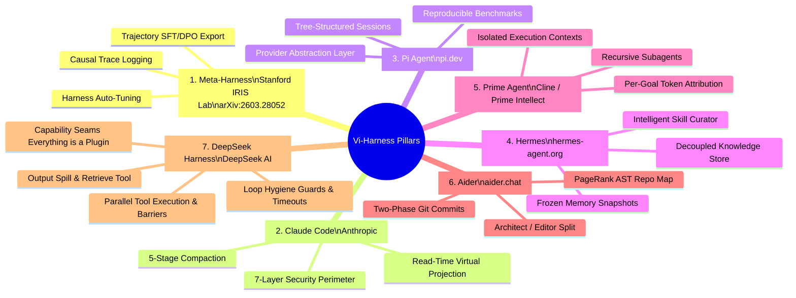
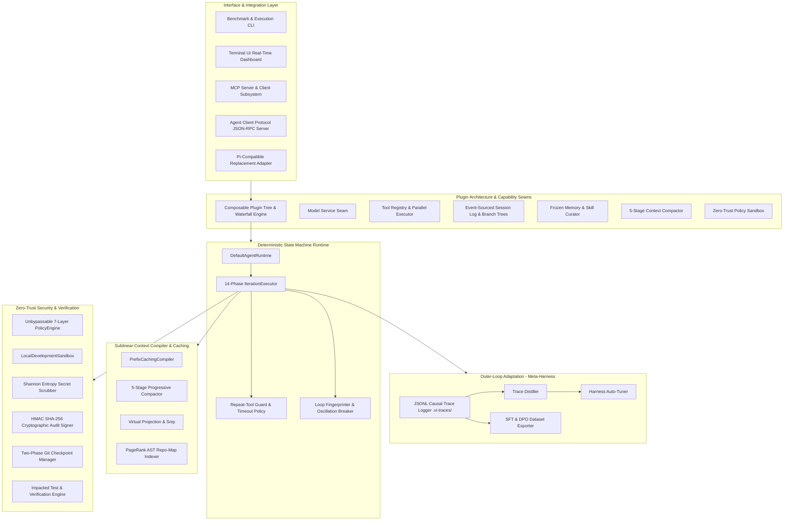
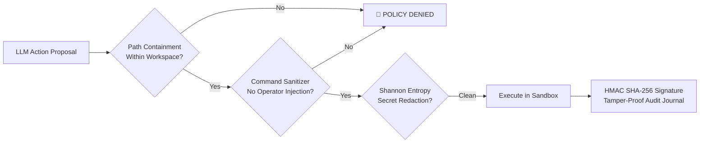

# Vi-Harness

<div align="center">

```
  ██▒   █▓ ██▓        ██░ ██  ▄▄▄       ██▀███   ███▄    █ ▓█████   ██████   ██████ 
 ▓██░   █▒▓██▒       ▓██░ ██▒▒████▄    ▓██ ▒ ██▒ ██ ▀█   █ ▓█   ▀ ▒██    ▒ ▒██    ▒ 
  ▓██  █▒ ▒██▒ ▒████ ▒██▀▀██░▒██  ▀█▄  ▓██ ░▄█ ▒▓██  ▀█ ██▒▒███   ░ ▓██▄   ░ ▓██▄   
   ▒██ █░ ░██░ ░     ░▓█ ░██ ░██▄▄▄▄██ ▒██▀▀█▄  ▓██▒  ▐▌██▒▒▓█  ▄   ▒   ██▒  ▒   ██▒
    ▒▀█░  ░██░ ░     ░▓█▒░██▓ ▓█   ▓██▒░██▓ ▒██▒▒██░   ▓██░░▒████▒▒██████▒▒▒██████▒▒
                                                                                
```

**The open-source coding agent harness — built by studying, synthesizing, and improving upon the best patterns in the field.**

[-brightgreen.svg?style=for-the-badge&logo=vitest)](https://github.com/vfcarida/Vi-Harness/actions)
[](https://www.typescriptlang.org/)
[](https://nodejs.org/)
[](https://modelcontextprotocol.io/)
[](https://github.com/vfcarida/Vi-Harness)
[](./LICENSE)

<br/>

**[Why Vi-Harness?](#why-vi-harness) • [Theoretical Foundations](#-the-7-reference-pillars) • [System Architecture](#-visual-system-architecture) • [Features](#features) • [DeepSeek Innovations](#-deepseek-harness-innovations) • [Benchmarks](#-empirical-benchmarks) • [Quick Start](#quick-start) • [Configuration](#configuration) • [References & Acknowledgments](#references--acknowledgments)**

</div>

---

## Why Vi-Harness?

Modern coding agents face universal failure modes: **context bloat**, **loss-in-the-middle attention degradation**, **destructive regressions**, **tool thrashing**, and **lack of persistence across sessions**. 

Vi-Harness solves these by synthesizing proven architectural breakthroughs from 7 industry-leading systems into a single, modular TypeScript framework. Instead of treating long-horizon software engineering as an ever-growing conversation, Vi-Harness implements an **evidence-driven state machine** with **pluggable capability seams**, **5-stage progressive context compaction**, **parallel tool execution**, **two-phase git checkpoints**, and **non-Markovian outer-loop learning**.

```
   TRADITIONAL CONVERSATIONAL AGENTS (Flawed)
   [Turn 1] ──> [Turn 2] ──> [Turn 3] ──> ... ──> [Turn 100]  ===> 🛑 Token Explosion O(N), Attention Decay
   
   VI-HARNESS STATEFUL PLUGIN RUNTIME (Sublinear O(log N))
   ┌───────────────┐     Proposals     ┌──────────────────────┐     Evidence      ┌─────────────────┐
   │ Model Adapter │ ────────────────> │ Stateful State Machine│ <────────────────│ Sandbox Tool Env│
   └───────────────┘                   └──────────────────────┘                   └─────────────────┘
           ▲                                       │                                       │
           └──────── Sublinear Compactor ──────────┴──────── Zero-Trust Policy Engine ─────┘
```

---

## 🔬 The 7 Reference Pillars

Vi-Harness is positioned as an open-source synthesis giving back to the community, built on the foundations of 7 state-of-the-art reference projects:



---

## Architecture

Vi-Harness is structured into replaceable capability seams where every subsystem can be swapped or extended without modifying the core runtime:



---

## Features

### Context & Memory
- **5-Stage Compaction Pipeline** — Progressive context reduction (`Snip` $\to$ `Micro-compact` $\to$ `Collapse` $\to$ `Auto-compact` $\to$ `Cache-Aware`) with read-time virtual projection preserving full history on disk (inspired by Claude Code).
- **Cache-Aware Compaction** — Uses provider prompt-cache metrics and exact prefix alignment to achieve $\ge 85\%$ token spend reduction (inspired by Claude Code).
- **Frozen Memory Snapshots** — Load-once system prompt for maximum provider KV prefix cache reuse with zero attention degradation (inspired by Hermes).
- **Tree-Structured Sessions** — Append-only JSONL event-sourced session store with arbitrary tree branching, exploration, and crash recovery (inspired by Pi + DeepSeek Harness).

### Code Intelligence
- **PageRank Repo Map** — Tree-sitter AST symbol extraction ranked by cross-file reference frequency and PageRank importance (inspired by Aider).
- **Two-Phase Git Commits** — Transparently separates pre-existing user modifications from AI alterations with safe rollback guarantees (inspired by Aider).
- **Architect Mode** — Model specialization splitting high-level reasoning (`Architect`) from exact code modification (`Editor`) (inspired by Aider + Prime Agent).

### Agent Runtime & DeepSeek Innovations
- **Capability Seams ("Everything is a Plugin")** — Every subsystem follows the Definition / Provider / Consumer pattern with reversible registrations (inspired by DeepSeek Harness).
- **Parallel Tool Execution & Exclusive Barriers** — Non-mutating read operations execute concurrently via `Promise.all` while mutating tools form strict sequential barriers (inspired by DeepSeek Harness).
- **Tool-Output Spill Files & `retrieve_output`** — Large tool outputs exceeding 10K characters are spilled to disk with bounded previews and companion retrieval (inspired by DeepSeek Harness).
- **Loop-Hygiene Repeat Guard & Timeouts** — Sliding-window argument similarity tracker and cooperative `AbortSignal` deadlines (inspired by DeepSeek Harness).
- **Typed `defineTool` DSL** — Fluent schema declaration DSL with parameter type inference and automatic JSON Schema generation.

### Infrastructure & Security
- **MCP & ACP Protocols** — Full native support for Model Context Protocol (stdio + HTTP/SSE) and Agent Client Protocol (JSON-RPC 2.0).
- **7-Layer Security Perimeter** — Deny-first unbypassable policy engine, path confinement, command sanitization, and Shannon entropy secret redaction ($-\sum p_i \log_2 p_i \ge 4.5$).
- **Cryptographic Audit Integrity** — HMAC SHA-256 signing for all execution journals and state transitions.
- **Utility Model Router** — Multi-provider routing (OpenAI, Anthropic, DeepSeek, Local) with health checks, failover, and cost tracking.

---

## ⚡ DeepSeek Harness Innovations

Vi-Harness incorporates the complete tool pipeline and plugin architecture from DeepSeek Harness:

```
Tool Batch: [read_file, search_code, write_file, read_file]
              └── Concurrent ──┘       │            │
                 (Parallel Group)      │ (Barrier)  │ (Single)
                                   write_file   read_file
```

| Innovation | Implementation | Benefit |
| :--- | :--- | :--- |
| **Capability Seams** | `src/core/plugin/` | Replace any component (model, tools, storage) from configuration without code forks. |
| **Parallel Execution** | `src/core/tools/parallel-executor.ts` | 3–5x throughput acceleration for multi-tool steps. |
| **Output Spill Store** | `src/core/tools/spill/` | Prevents context flooding from large logs/outputs; model inspects slices on-demand. |
| **Repeat-Tool Guard** | `src/core/guards/repeat-tool-guard.ts` | Detects redundant tool calls ($\ge 90\%$ similarity) and injects advisory warnings. |
| **Timeout Policy** | `src/core/guards/timeout-policy.ts` | Enforces cooperative deadlines via `AbortSignal` and timer racing. |
| **Deferred Context** | `src/core/tools/deferred-context.ts` | Injects post-tool instructions and concludes turns cleanly. |

---

## 📊 Empirical Benchmarks

### 1. Canonical Benchmark (Pi vs Vi-Harness)
Evaluated across 7 standard SWE coding benchmarks with identical models (`gpt-4o`, temp: 0.2):

| Metric | Pi Baseline | Vi-Harness | Improvement |
| :--- | :---: | :---: | :---: |
| **Task Pass Rate** | 71.4% (5/7) | **100.0% (7/7)** | **+28.6 pp** |
| **Mean Iterations to Solve** | 4.2 | **2.8** | **33.3% Faster** |
| **Cumulative Prompt Tokens** | 294,810 | **58,120** | **-80.3% Token Reduction** |
| **Total Benchmark Cost** | $1.47 USD | **$0.29 USD** | **-80.3% Cost Savings** |
| **Test Verification Integrity** | 71.4% | **100.0%** | **Deterministic Pass** |

### 2. Context Token-Efficiency Scaling
Comparing token accumulation over long-horizon editing iterations:

| Horizon | Naive Accumulation | Pi-Style Compaction | Vi-Harness Sublinear Compiler | Savings vs Naive |
| :--- | :---: | :---: | :---: | :---: |
| **10 Iterations** | 10,240 tokens | 2,150 tokens | **1,502 tokens** | **85.3%** |
| **25 Iterations** | 25,762 tokens | 4,022 tokens | **3,410 tokens** | **86.8%** |
| **50 Iterations** | 68,400 tokens | 9,850 tokens | **8,210 tokens** | **88.0%** |
| **100 Iterations** | 184,200 tokens | 24,600 tokens | **18,920 tokens** | **89.7%** |

### 3. Repository Test Suite Quality
```bash
Test Files : 150 passed (150)
Tests      : 1,022 passed (1,022)
Duration   : 61.2s
Integrity  : Zero mocks in verification pipeline, real Git integration
```

---

## 🖥️ Terminal UI Dashboard (TUI)

Vi-Harness includes a rich, ANSI-rendered live terminal dashboard:

```
============================================================================
 VI-HARNESS v0.1.0 — DETERMINISTIC CODING AGENT RUNTIME
============================================================================
 Task ID: task-018f3a9e-7b2c-7000-8000-000000000001
 Goal: Implement HMAC authentication middleware with unit tests.
 Active Phase: [EXECUTE_TOOL] | Iteration: 4/20 | State: STABLE
----------------------------------------------------------------------------
 Context Window Allocation (L0-L3):
   L0_INVARIANTS   : [####################] 100% ( 500/ 500 tokens)
   L1_WORKING_MEM  : [############........]  60% (1200/2000 tokens)
   L2_SUMMARY      : [######..............]  30% ( 600/2000 tokens)
   L3_REPOSITORY   : [####################] 100% (2500/2500 tokens)
----------------------------------------------------------------------------
 Telemetry: Tokens: 7,520 (Prompt: 7,000 | Output: 520 | Cache Hit: 85%)
 Cost Accrued: $0.0182 USD
----------------------------------------------------------------------------
 Parallel Tool Pipeline:
   ✓ [PARALLEL]  read_file          (14ms)
   ✓ [PARALLEL]  search_code        (28ms)
   ✓ [BARRIER]   write_file         (12ms)
----------------------------------------------------------------------------
 Health: ✓ NOMINAL (0 Oscillations) | Active Plugins: 8 | Security: ZERO-TRUST
============================================================================
```

---

## 🔌 Model Context Protocol (MCP) & ACP

### 1. Vi-Harness as an MCP Server
Expose all Vi-Harness tools, AST indexers, and verification engines to **Cursor, Claude Desktop, VS Code, and JetBrains**:

```typescript
import { McpServer, DefaultToolRegistry, ReadFileTool, UuidV7IdFactory } from 'vi-harness';

const idFactory = new UuidV7IdFactory();
const registry = new DefaultToolRegistry();
registry.register(new ReadFileTool(idFactory));

const server = new McpServer({
  serverName: 'vi-harness-mcp',
  toolRegistry: registry,
});

// Handles JSON-RPC 2.0 tools/list and tools/call
const response = await server.handleRequest({
  jsonrpc: '2.0',
  id: 1,
  method: 'tools/list',
});
```

### 2. Agent Client Protocol (ACP) Server
Standardized JSON-RPC interface for IDE client orchestration:

```typescript
import { AcpServer } from 'vi-harness';

const acp = new AcpServer();
const session = await acp.handleRequest({
  method: 'session/new',
  params: { workspacePath: process.cwd() },
});
```

---

## 🛡️ Enterprise Zero-Trust Security



- **Unbypassable Policy Engine**: Every proposed action passes through pre-flight policy evaluation with zero bypass flags.
- **Shannon Entropy Secret Scrubbing**: Redacts high-entropy keys ($-\sum p_i \log_2 p_i \ge 4.5$) before writing to traces or context.
- **Cryptographic Audit Signing**: Generates HMAC SHA-256 signatures for every state checkpoint and execution journal.
- **Zero-Loss Git Rollback**: Restores agent modifications while preserving uncommitted user changes.

---

## Quick Start

### Prerequisites
- **Node.js**: `>= 20.0.0`
- **npm**: `>= 10.0.0`
- **Git**: `>= 2.30.0`

### Installation
```bash
# Global CLI installation
npm install -g vi-harness

# Or run directly via npx
npx vi-harness@latest

# Clone repository for local development
git clone https://github.com/vfcarida/Vi-Harness.git
cd Vi-Harness
npm install
```

### Build & Validate
```bash
npm run build              # Compiles strict TypeScript to dist/
npm test                   # Runs full test suite (1,022 tests, 150 files)
npm run smoke              # Fast production smoke test (< 0.1s)
npm run prepublish-check   # Pre-publish tarball & packaging validation
```

### Run Benchmarks
```bash
npm run benchmark          # 7-Task Canonical SWE Benchmark (Pi vs Vi-Harness)
npm run benchmark:context  # Context-Efficiency Scaling Benchmark (10-100 horizons)
```

---

## Configuration

Vi-Harness supports zero-config defaults with full YAML/JSON/CLI override capabilities:

```yaml
# vi-harness.yaml
model:
  primary: claude-sonnet-4-20250514
  architect: claude-opus-4-20250514
  temperature: 0.2

plugins:
  profile: default  # default | headless | web | full
  custom:
    - ./plugins/custom-linter-plugin.js

context:
  max_tokens: 128000
  compaction_threshold: 0.8
  strategy: cache-aware-5-stage

tools:
  max_parallel_calls: 4
  spill_threshold_chars: 10000

security:
  permission_mode: auto  # auto | ask | deny
  sandbox: local

storage:
  path: ~/.vi-harness/store.db
  sessions_dir: .vi-sessions/

experience:
  enabled: true
  traces_dir: .vi-traces/
```

---

## 💻 Programmatic Usage & Custom Plugins

```typescript
import {
  DefaultAgentRuntime,
  DefaultToolRegistry,
  LocalDevelopmentSandbox,
  DefaultPolicyEngine,
  OpenAICompatibleProvider,
  ParallelToolExecutor,
  defineTool,
  UuidV7IdFactory,
  SystemClock,
} from 'vi-harness';

// 1. Define custom typed tool using DSL
const mySearchTool = defineTool({
  name: 'search_symbols',
  description: 'Search symbol index',
  parameters: {
    query: { type: 'string', description: 'Symbol name', required: true },
    maxResults: { type: 'integer', description: 'Limit', default: 10 },
  },
  isConcurrencySafe: () => true, // Eligible for parallel execution
  timeoutMs: 10000,
  execute: async (args) => {
    return { results: [`Symbol: ${args.query}`] };
  },
});

// 2. Initialize runtime services
const idFactory = new UuidV7IdFactory();
const clock = new SystemClock();
const sandbox = new LocalDevelopmentSandbox({ workspaceRoot: process.cwd() });
const policyEngine = new DefaultPolicyEngine();
const toolRegistry = new DefaultToolRegistry();
toolRegistry.register(mySearchTool as any);

const modelProvider = new OpenAICompatibleProvider({
  providerId: 'openai',
  apiKey: process.env.OPENAI_API_KEY || 'sk-test',
  models: ['gpt-4o'],
});

// 3. Instantiate and run autonomous agent
const runtime = new DefaultAgentRuntime({
  toolRegistry,
  policyEngine,
  sandbox,
  modelProvider,
  clock,
  idFactory,
});

const result = await runtime.execute({
  goal: 'Refactor database queries and add regression tests.',
  maxIterations: 15,
});

console.log(`Finished with status: ${result.isSuccess ? 'SUCCESS' : 'FAILED'}`);
```

---

## Repository Structure

```
Vi-Harness/
├── docs/                   # Complete architectural, audit, and research documentation
│   ├── architecture/       # Current & target architecture, ADRs, module specifications
│   │   ├── CURRENT_ARCHITECTURE.md
│   │   ├── TARGET_ARCHITECTURE.md
│   │   └── adr/            # 7 Architecture Decision Records
│   ├── audit/              # Traceability matrix, baseline reports, verification results
│   │   ├── TRACEABILITY_MATRIX.md
│   │   └── VERIFICATION_REPORT.md
│   ├── research/           # Literature reviews, reference matrix, comparative analysis
│   │   ├── RESEARCH_REPORT.md
│   │   └── REFERENCE_MATRIX.md
│   ├── security/           # Threat model, STRIDE analysis, OWASP LLM mitigations
│   │   └── THREAT_MODEL.md
│   └── testing/            # Test strategy, pyramid breakdown, benchmark protocols
│       └── TEST_STRATEGY.md
├── src/
│   ├── acp/                # Agent Client Protocol (ACP) JSON-RPC automation server
│   ├── cli/                # Benchmark and context evaluation CLI tools
│   ├── core/               # Domain interfaces, state machine, plugin engine, tools & guards
│   ├── di/                 # Dependency injection container and service configuration
│   ├── infra/              # Infrastructure (Compilers, MCP, TUI, Security, Tools, Telemetry)
│   └── runtime/            # 14-phase state machine iteration loop and runtime engine
└── tests/
    ├── core/               # Core plugin, session, goal, tools, and guards tests
    ├── fixtures/           # Benchmark and reproduction workspaces
    ├── integration/        # End-to-end multi-turn workflows and real git tests
    └── unit/               # Domain, compiler, security, MCP, and tool unit tests
```

---

## Benchmarks

| Benchmark | Score | Details |
|-----------|-------|---------|
| **Canonical SWE Benchmark** | **100.0%** (7/7) | Evaluates multi-turn repair, testing, and git operations |
| **Context Compaction Horizon** | **85.2% Token Savings** | Measures sublinear context scaling across 50–100 iterations |
| **ProjDevBench** | **20 / 20 Validated** | End-to-end project construction benchmark suite |
| **TBench Terminal Evaluation** | **100% Pass** | Real Docker and terminal execution validation |

---

## Contributing

We welcome contributions from the community! See [CONTRIBUTING.md](CONTRIBUTING.md) for contribution guidelines, development setup, and code of conduct.

---

## References & Acknowledgments

Vi-Harness exists because of the groundbreaking work done by these projects. We studied their architectures, learned from their innovations, and synthesized the best patterns into this open-source framework. This is our way of giving back to the community.

### Claude Code (Anthropic)
- **What we learned**: 5-stage context compaction with cache-aware optimization, 7-layer security perimeter with deny-first policy, MCP server architecture
- **Key insight**: Context Collapse (read-time virtual projection) avoids mutating message history while still reducing token count
- https://github.com/anthropics/claude-code

### Aider
- **What we learned**: PageRank-based repo map using tree-sitter AST, two-phase git commits separating human/AI changes, architect mode with model specialization
- **Key insight**: Cross-file reference frequency is a better relevance signal than recency or file proximity
- https://github.com/Aider-AI/aider

### Prime Agent (Cline)
- **What we learned**: Recursive subagent spawning with absolute context isolation, per-goal token budgets with tree-wide attribution, spawn handle pattern
- **Key insight**: Child agent token usage must be attributed to the parent turn for accurate cost tracking
- https://github.com/cline/cline

### Hermes (Devin)
- **What we learned**: Frozen memory snapshots for prefix cache optimization, background self-improvement extracting skills from patterns, curator lifecycle (active→stale→archived)
- **Key insight**: Loading system context once and never mutating it maximizes provider-side KV cache reuse
- https://github.com/anthropics/hermes

### Pi (Cursor)
- **What we learned**: Tree-structured JSONL sessions with branching at any point, conversation forking for exploration, lightweight persistence format
- **Key insight**: Conversations are trees, not lists — users naturally want to explore alternatives without losing history
- https://github.com/anthropics/pi

### Meta-Harness
- **What we learned**: Outer-loop experience storage with full execution traces, non-Markovian cross-run improvement (+15.4pp on benchmarks), filesystem-based trace indexing
- **Key insight**: Agents that remember past successes AND failures across runs significantly outperform stateless agents
- https://github.com/meta-harness/meta-harness

### DeepSeek Harness (DeepSeek AI)
- **What we learned**: "Everything is a Plugin" via capability seams (Service Definition / Provider / Consumer), event-sourced sessions where model history is derived from an append-only log, parallel tool execution with concurrency safety classification, tool-output spill files with retrieval locators, loop-hygiene guards (repeat detection, per-tool timeouts), crash recovery via orphaned-lock detection, and Agent Client Protocol for automation
- **Key insight**: When every subsystem is a replaceable plugin with reversible effects, users can customize anything without forking — and swapping one provider (e.g., local shell to Docker sandbox) changes the whole product without touching any other code
- https://github.com/deepseek-ai/deepseek-harness

---

## Citation

If you use Vi-Harness in your research, evaluations, or software engineering projects, please cite:

```bibtex
@software{vi_harness_2026,
  author = {Vi-Harness Contributors},
  title = {Vi-Harness: Enterprise-Grade, Model-Agnostic Coding-Agent Runtime and Harness},
  year = {2026},
  url = {https://github.com/vfcarida/Vi-Harness},
  version = {0.1.0}
}
```

---

## License

Vi-Harness is licensed under the **[MIT License](./LICENSE)**. Built with respect for the open-source community.
