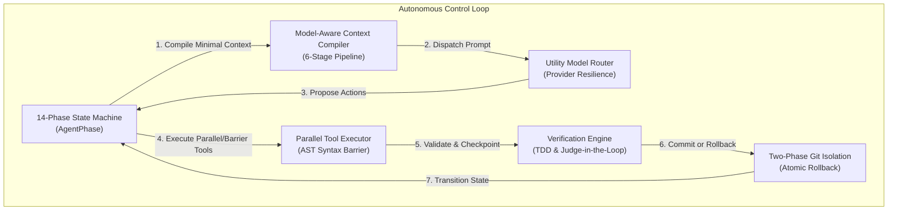
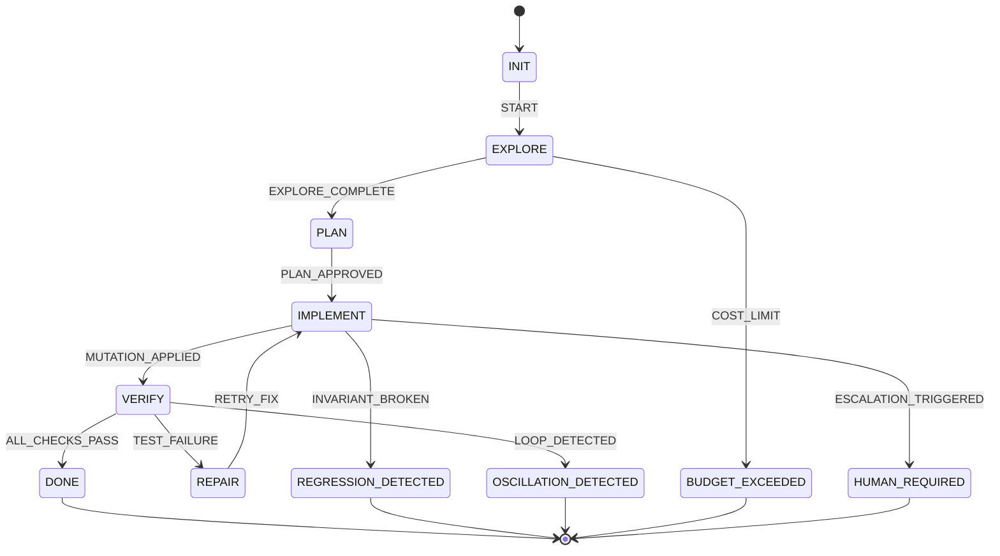
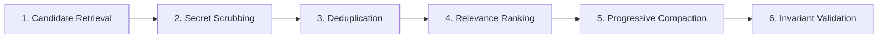
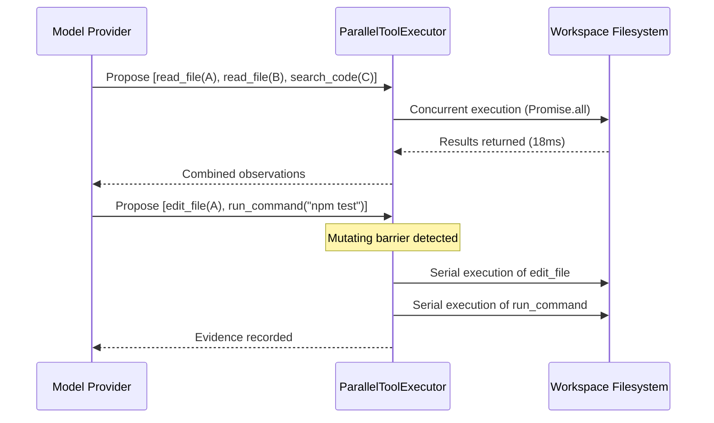

# 🗺️ Vi-Harness Architecture Tour & Extension Guide

> **"The agent is not a persistent conversation. The agent is a stateful, evidence-driven finite state machine with a compiled context window."**

Welcome to the **Vi-Harness Architectural Tour**. This document serves as the canonical technical guide for contributors, framework authors, and AI engineers. It details the runtime lifecycle, context compilation subsystems, safety barriers, and provides hands-on recipes for extending Vi-Harness.

---

## 📑 Table of Contents

1. [Core Mental Model](#1-core-mental-model)
2. [The 14 FSM Phases & State Machine Lifecycle](#2-the-14-fsm-phases--state-machine-lifecycle)
3. [Context Engineering: Tiers & The 6-Stage Compiler](#3-context-engineering-tiers--the-6-stage-compiler)
4. [Tool Execution: AST Gating & Concurrency Dispatch](#4-tool-execution-ast-gating--concurrency-dispatch)
5. [Verification, Two-Phase Git Isolation & Judge-in-the-Loop](#5-verification-two-phase-git-isolation--judge-in-the-loop)
6. [Developer Extension Recipes](#6-developer-extension-recipes)
   - [Recipe 1: Authoring and Registering a Custom Tool](#recipe-1-authoring-and-registering-a-custom-tool)
   - [Recipe 2: Implementing a Native Model Provider](#recipe-2-implementing-a-native-model-provider)
   - [Recipe 3: Adding an Automated Verification Gate / External Judge](#recipe-3-adding-an-automated-verification-gate--external-judge)
   - [Recipe 4: Runtime Event Telemetry & Custom Observers](#recipe-4-runtime-event-telemetry--custom-observers)
7. [Architectural Invariants & Dependency Rules](#7-architectural-invariants--dependency-rules)

---

## 1. Core Mental Model

Traditional conversational agents suffer from a fundamental flaw: they treat an entire engineering task as an ever-growing linear list of chat turns:

$$\text{Token Count} = \mathcal{O}(N) \quad \implies \quad \text{Attention Degradation, Context Bloat, Lost Regressions}$$

Vi-Harness inverts this paradigm. Rather than accumulating message history, Vi-Harness executes an **evidence-driven finite state machine (FSM)** where every iteration reads from and writes to strongly typed domain stores:



---

## 2. The 14 FSM Phases & State Machine Lifecycle

In Vi-Harness, the LLM **cannot** directly jump to arbitrary terminal states. Every state transition passes through the runtime transition matrix in [`src/core/model/state.ts`](../../src/core/model/state.ts) and [`src/runtime/transition-validator.ts`](../../src/runtime/transition-validator.ts).

### The 14 Canonical Phases (`AgentPhase`)

| Phase | Category | Purpose |
| :--- | :--- | :--- |
| `INIT` | Setup | Task accepted, workspace indexed, instructions loaded. |
| `EXPLORE` | Discovery | Read workspace files, locate symbols, analyze dependencies. |
| `PLAN` | Strategy | Formulate hypotheses, generate step-by-step implementation plans. |
| `IMPLEMENT` | Mutating | Edit files, apply atomic search-and-replace, write new source code. |
| `VERIFY` | Validation | Run polyglot test runners, typechecks, linters, and judges. |
| `REPAIR` | Remediation | Fix syntax errors, regression failures, or broken test assertions. |
| `DONE` | Terminal (Success) | Task verified and validated by evidence gates. |
| `BLOCKED` | Paused | External dependency missing or tool barrier reached. |
| `HUMAN_REQUIRED` | Terminal (Intervention) | Sensitive mutation or budget requires human approval. |
| `BUDGET_EXCEEDED` | Terminal (Safety) | Maximum token, iteration, or monetary cost reached. |
| `REGRESSION_DETECTED`| Terminal (Safety) | Mutation broke previously passing invariant tests. |
| `OSCILLATION_DETECTED`| Terminal (Safety) | Agent cycling between identical states without net progress. |
| `CANCELLED` | Terminal (Abort) | Interrupted via CLI signal (SIGINT/SIGTERM) or user command. |
| `FAILED` | Terminal (Error) | Unrecoverable infrastructure or runtime exception. |

### Lifecycle State Machine Diagram



---

## 3. Context Engineering: Tiers & The 6-Stage Compiler

Vi-Harness strictly follows the doctrine: **"Context is compiled, not accumulated."**

### The 4 Memory Tiers (`ContextTier`)

Defined in [`src/core/model/context.ts`](../../src/core/model/context.ts):

1. **`L0_HOT` (Invariants)**: The current goal, mandatory safety instructions (`VI.md`, `CLAUDE.md`, `AGENTS.md`), target file paths, and current failing compiler errors. *Never pruned or truncated.*
2. **`L1_WORKING` (Active Hypothesis & Plan)**: Current architectural decisions, active hypothesis, and evidence collected in the current iteration.
3. **`L2_EPISODIC` (Trajectory History)**: Summaries of prior attempts, rejected hypotheses, and previous test runs.
4. **`L3_REPOSITORY` (Permanent Context)**: File trees, symbol maps, API contracts, and persistent knowledge artifacts.

### The 6-Stage Compilation Pipeline

Whenever a model completion is triggered, [`DefaultContextCompiler`](../../src/infra/compiler/default-context-compiler.ts) executes the following pipeline:



1. **Retrieval**: Gathers candidates from `ContextStore` and RAG `MemoryStore`.
2. **Secret Scrubbing**: Strips API keys, passwords, bearer tokens, and JWTs via [`SecretScrubber`](../../src/infra/security/secret-scrubber.ts).
3. **Deduplication**: Eliminates overlapping file chunks and identical terminal outputs via content hashing.
4. **Relevance Ranking**: Scores items using reciprocal rank fusion (recency, tier priority, edit distance to active task).
5. **Progressive Compaction**: If the token budget is tight, compresses code blocks into AST skeleton signatures (`function foo(x: string): void`) using [`SourceCodeIndexer`](../../src/infra/syntax/source-code-indexer.ts).
6. **Invariant Validation**: Enforces hard budget ceiling; guarantees invariant tokens (`L0`) are preserved with zero data loss.

---

## 4. Tool Execution: AST Gating & Concurrency Dispatch

Tool execution occurs through [`ParallelToolExecutor`](../../src/infra/tools/parallel-tool-executor.ts) and [`DefaultToolExecutor`](../../src/infra/tools/default-tool-executor.ts).

### Pre-Write AST Syntax Gate (`PreWriteSyntaxGate`)

Before any file modification (`write_file`, `edit_file`) hits the filesystem, the proposed patch is passed through an AST parser (TypeScript/JavaScript via TypeScript Compiler API, Python, Rust, or JSON/YAML):

- If the patch creates a syntax error, the disk write is **aborted immediately**.
- A detailed syntax diagnostic is fed back into the agent's working memory as an observation:
  `[PreWriteSyntaxGate] Patch rejected: Unterminated string literal at line 42, col 18.`
- **Result**: Zero broken intermediate states on disk, preserving build and test integrity.

### Concurrent Reads vs. Mutating Barriers

Tools declare their concurrency safety via `isConcurrencySafe(args)`:



---

## 5. Verification, Two-Phase Git Isolation & Judge-in-the-Loop

Vi-Harness guarantees reproducibility through isolation and verifiable evidence.

### Two-Phase Git Checkpoints
Managed by [`RealGitManager`](../../src/infra/git/real-git-manager.ts) and [`WorktreeIsolationManager`](../../src/infra/git/worktree-isolation-manager.ts):
- **Pre-Mutation Snapshot**: A temporary git commit or worktree checkpoint is created before each agent turn.
- **Rollback on Regression**: If tests fail or syntax errors persist beyond the configured threshold, the workspace is automatically rolled back to the pristine SHA.

### Judge-in-the-Loop Architecture
Configured via `--judge-command "<command>"` or `--judge-retries <n>`:
1. When the agent attempts to conclude (`ActionProposed: DONE`), the runtime intercepts the termination.
2. The independent judge command (e.g. `npm test`, `pytest`, or an external verification script) is executed in a clean subprocess.
3. If the judge passes (exit code 0), the session successfully transitions to `AgentPhase.DONE`.
4. If the judge fails, the stdout/stderr error is captured into an evidence envelope, and the agent is transitioned into `AgentPhase.REPAIR` with an incremented judge retry counter.

---

## 6. Developer Extension Recipes

### Recipe 1: Authoring and Registering a Custom Tool

All tools implement the [`ToolDefinition`](../../src/core/model/tool-types.ts) contract.

```typescript
import {
  ToolCategory,
  ToolRiskLevel,
  type ToolDefinition,
} from 'vi-harness/core';
import type { DefaultToolRegistry } from 'vi-harness/infra';

// 1. Define your tool contract and schema
export const calculateHashTool: ToolDefinition = {
  name: 'calculate_file_hash',
  version: '1.0.0',
  description: 'Computes SHA-256 checksum of a file in the workspace.',
  category: ToolCategory.READ,
  riskLevel: ToolRiskLevel.LOW,
  mutating: false,
  idempotent: true,
  defaultTimeoutMs: 5000,
  requiredPermissions: ['fs:read'],
  inputSchema: {
    type: 'object',
    properties: {
      filePath: { type: 'string', description: 'Relative path to target file' },
    },
    required: ['filePath'],
  },
  // Mark tool as concurrency-safe (can run concurrently with other reads)
  isConcurrencySafe: () => true,

  // Direct execution handler
  execute: async ({ filePath }: { filePath: string }, context) => {
    const crypto = await import('node:crypto');
    const fs = await import('node:fs/promises');
    const path = await import('node:path');

    const fullPath = path.resolve(context.workspacePath, filePath);
    const buffer = await fs.readFile(fullPath);
    const hash = crypto.createHash('sha256').update(buffer).digest('hex');

    return {
      output: JSON.stringify({ filePath, sha256: hash }),
      isError: false,
    };
  },
};

// 2. Register in runtime tool registry
export function registerCustomTools(registry: DefaultToolRegistry): void {
  registry.registerTool(calculateHashTool);
}
```

---

### Recipe 2: Implementing a Native Model Provider

All LLM backends implement [`ModelProvider`](../../src/core/interfaces/model-provider.ts). Notice that **no vendor SDK types** cross this boundary.

```typescript
import type {
  ModelProvider,
  ModelRequest,
  ModelResponse,
  ModelStreamChunk,
  ModelDescriptor,
  ModelHealth,
} from 'vi-harness/core';
import { ModelCapability, ProviderHealthStatus, FinishReason } from 'vi-harness/core';

export class CustomInferenceProvider implements ModelProvider {
  public readonly providerId = 'custom-backend';
  public readonly descriptor: ModelDescriptor = {
    id: 'my-custom-model-v1',
    name: 'Custom Enterprise LLM',
    providerId: this.providerId,
    version: '1.0.0',
    capabilities: {
      capabilities: new Set([
        ModelCapability.CODING,
        ModelCapability.TOOL_USE,
        ModelCapability.STREAMING,
      ]),
      maxContextTokens: 64000,
      maxOutputTokens: 4096,
      supportsSystemPrompt: true,
    },
    costPer1kInputTokensDollars: 0.001,
    costPer1kOutputTokensDollars: 0.002,
  };

  async complete(request: ModelRequest): Promise<ModelResponse> {
    const start = Date.now();

    // Call your internal HTTP or gRPC model gateway
    const res = await fetch('https://model-gateway.internal/v1/generate', {
      method: 'POST',
      headers: { 'Content-Type': 'application/json' },
      body: JSON.stringify({
        prompt: request.messages,
        tools: request.tools,
      }),
    });

    const data = await res.json();

    return {
      requestId: `req-${Date.now()}`,
      content: data.output_text,
      toolCalls: data.tool_calls ?? [],
      finishReason: data.stop_reason === 'tool' ? FinishReason.TOOL_CALL : FinishReason.STOP,
      usage: {
        inputTokens: data.usage.prompt_tokens,
        outputTokens: data.usage.completion_tokens,
        totalTokens: data.usage.total_tokens,
      },
      latencyMs: Date.now() - start,
      estimatedCostDollars: (data.usage.total_tokens / 1000) * 0.0015,
      modelId: this.descriptor.id,
      providerId: this.providerId,
    };
  }

  async *stream(request: ModelRequest): AsyncIterable<ModelStreamChunk> {
    // Yield streaming chunks
    yield { deltaText: 'Processing...' };
  }

  async getHealth(): Promise<ModelHealth> {
    return {
      providerId: this.providerId,
      status: ProviderHealthStatus.HEALTHY,
      latencyMs: 12,
      lastChecked: new Date(),
    };
  }
}
```

---

### Recipe 3: Adding an Automated Verification Gate / External Judge

You can enforce rigorous domain-specific constraints (e.g. security audits, license checks, performance budgets) by implementing an independent verification rule or orchestrator hook:

```typescript
import { JudgeInTheLoopOrchestrator } from 'vi-harness/infra';

// Instantiate external judge orchestrator
const judgeOrchestrator = new JudgeInTheLoopOrchestrator({
  judgeCommand: 'npm run test:ci && npx eslint .',
  workspacePath: process.cwd(),
  maxJudgeRetries: 3,
  timeoutMs: 60000,
});

// Run validation pass before accepting completion
const judgeResult = await judgeOrchestrator.evaluate({
  iteration: 5,
  proposedDone: true,
});

if (!judgeResult.passed) {
  console.error(`Judge rejected completion: ${judgeResult.failureSummary}`);
  // Feeding failure output back into agent working memory
}
```

---

### Recipe 4: Runtime Event Telemetry & Custom Observers

Subscribe to structured runtime events in real time (e.g. streaming to Slack, Datadog, or terminal):

```typescript
import { DefaultAgentRuntime } from 'vi-harness/runtime';
import { AgentEventType, type AgentEvent } from 'vi-harness/core';

export function attachTelemetry(runtime: DefaultAgentRuntime): void {
  runtime.onEvent((event: AgentEvent) => {
    switch (event.type) {
      case AgentEventType.IterationStarted:
        console.log(`[FSM] Iteration ${event.data.sequenceNumber} started in phase: ${event.data.stateBefore}`);
        break;

      case AgentEventType.ModelCalled:
        console.log(`[Cost Tracker] Tokens: ${event.data.tokens.totalTokens} ($${event.data.costDollars.toFixed(4)})`);
        break;

      case AgentEventType.ActionExecuted:
        console.log(`[Tool] Executed ${event.data.action.type} (Latency: ${event.data.durationMs}ms)`);
        break;

      case AgentEventType.AgentCompleted:
        console.log(`[Done] Agent succeeded. Final cost: $${event.data.totalCostDollars}`);
        break;
    }
  });
}
```

---

## 7. Architectural Invariants & Dependency Rules

To maintain high stability, strict deterministic behavior, and frictionless community adoption, Vi-Harness enforces the following engineering rules:

1. **Zero Runtime Bloat**: The runtime maintains strictly **3 production dependencies**:
   - `better-sqlite3` (for local ACID state and vector memory persistence)
   - `uuid` (for RFC 9562 UUIDv7 monotonic identifier generation)
   - `zod` (for runtime schema validation)
   *All HTTP interactions with OpenAI, Anthropic, Gemini, or Bedrock use native Node.js `fetch`.*
2. **Type Safety**: The codebase compiles with `strict: true` under TypeScript 5.8+. Never use `any` when a domain type can be expressed.
3. **Immutability by Default**: All domain entities, events, and model contracts use `ReadonlyArray` and `readonly` properties.
4. **Idempotent CLI Commands**: All subcommands (`solve`, `chat`, `tbench`, `eval`, `acp`, `mcp`) are non-destructive without explicit user intent or git checkpoints.

---

## 🔗 Related Documentation

- [Agent Control Loop & State Machine (`AGENT_LOOP.md`)](./AGENT_LOOP.md)
- [Context Engineering Invariants (`CONTEXT_ENGINEERING.md`)](./CONTEXT_ENGINEERING.md)
- [Multi-Tier Verification & Gates (`VERIFICATION.md`)](./VERIFICATION.md)
- [Zero-Trust Security & Path Sandboxing (`SECURITY.md`)](./SECURITY.md)
- [Model Routing & Provider Contracts (`MODEL_ROUTING.md`)](./MODEL_ROUTING.md)
