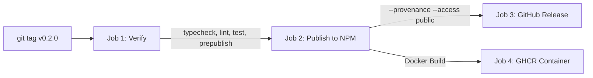

# Vi-Harness Release Operations Guide

> **Authoritative Maintainer Runbook for Versioning, Verification, and Distribution**

This document establishes the official release procedure for publishing `vi-harness` to npm and GitHub Container Registry (GHCR).

---

## 1. Release Architecture & Principles

Vi-Harness follows strict Semantic Versioning (`MAJOR.MINOR.PATCH`):
- **MAJOR**: Breaking changes to `src/core/` interfaces, tool definitions, or public CLI arguments.
- **MINOR**: Backward-compatible new features (e.g., new tools, compilers, model providers).
- **PATCH**: Backward-compatible bug fixes, performance optimizations, and security patches.

Every release requires:
1. **Zero Type Errors**: `npm run typecheck` (`strict: true`).
2. **Zero Test Failures**: `npm test` across all unit and integration suites.
3. **Badge Accuracy Guard**: `npm run check-readme-badge` passing.
4. **Prepublish Checklist**: `npm run prepublish-check` confirming distribution hygiene.
5. **Tarball Budget**: Unpacked size $< 5.0$ MB, compressed tarball $< 1.0$ MB.
6. **Supply-Chain Provenance**: Published with npm provenance (`--provenance`).

---

## 2. Pre-Release Verification (Local)

Run the automated pre-publish checklist prior to cutting a release:

```bash
# 1. Clean build & verification
npm run clean
npm run build
npm run typecheck
npm run lint
npm test

# 2. Validate README badge against test results
npm run check-readme-badge

# 3. Pre-publish integrity check
npm run prepublish-check

# 4. Dry-run package creation
npm pack --dry-run
```

Expected output:
```
📋 Pre-Publish Checklist Results:
   Status      : ✅ PASSED
   Package Size: ~2032.8 KB
```

---

## 3. Automated Release via GitHub Actions (Recommended)

The primary release pipeline is fully automated through [`.github/workflows/release.yml`](../../.github/workflows/release.yml).

### Prerequisites:
1. Ensure the `NPM_TOKEN` secret is configured in the GitHub repository:
   - Navigate to **Settings** > **Secrets and variables** > **Actions**.
   - Create a repository secret named `NPM_TOKEN` with an automation token from [npmjs.com](https://www.npmjs.com/).
2. Ensure GitHub Actions has `id-token: write` permission enabled for npm provenance.

### Triggering a Release:

#### Method A: Git Tag (Standard Release)
```bash
# Ensure you are on main and clean
git checkout main
git pull origin main

# Create annotated release tag
git tag -a v0.2.0 -m "Release v0.2.0: Wave 2 Frentes & Open Source Readiness"
git push origin v0.2.0
```

#### Method B: Manual Workflow Dispatch
1. Navigate to **Actions** > **Release** in GitHub.
2. Click **Run workflow**.
3. (Optional) Check **dry_run** to execute full verification without publishing.

---

## 4. What the Release Workflow Executes

When triggered by tag `v*`:



1. **Job: Verify**:
   - `npm ci`
   - `npm run typecheck`
   - `npm run lint`
   - `npm test`
   - `npm run build`
   - `npm run prepublish-check`
2. **Job: Publish**:
   - Publishes to npm using `NODE_AUTH_TOKEN: ${{ secrets.NPM_TOKEN }}`.
   - Generates cryptographic build provenance linking npm packages to the specific GitHub Action run.
3. **Job: GitHub Release**:
   - Automatically generates release notes from conventional commits.
   - Publishes release on GitHub Releases.
4. **Job: Docker**:
   - Builds container image and pushes `ghcr.io/vfcarida/vi-harness:0.2.0` and `:latest`.

---

## 5. Post-Release Verification

After release completion, verify the package globally:

```bash
# 1. Verify npm registry resolution
npm view vi-harness version

# 2. Test npx zero-install execution
npx vi-harness@latest --help

# 3. Test solve command
npx vi-harness@latest solve --help
```

---

## 6. Emergency Rollback & Deprecation

If a critical flaw is discovered in a published release:

```bash
# Deprecate the affected version with advisory warning
npm deprecate vi-harness@0.2.0 "Critical: please upgrade to v0.2.1 immediately due to CVE-XXXX"

# Never unpublish packages older than 72 hours (violates npm community policy)
```
